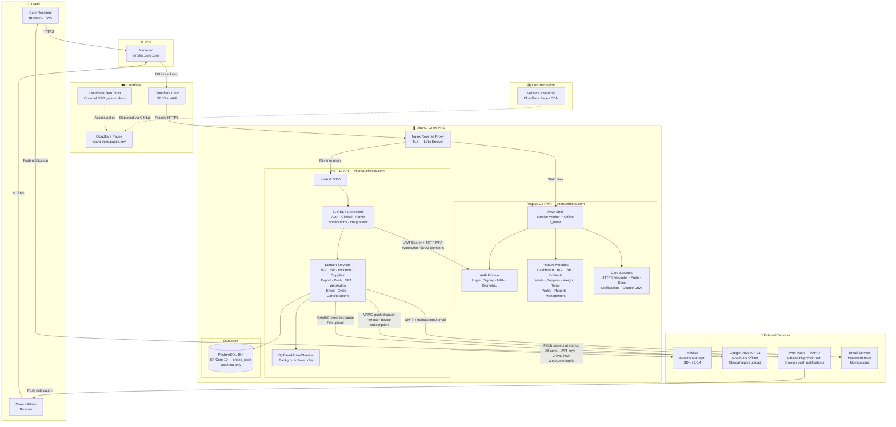
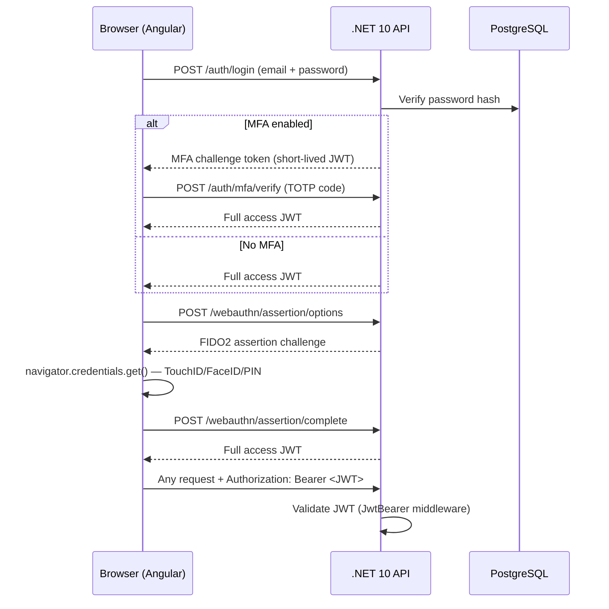
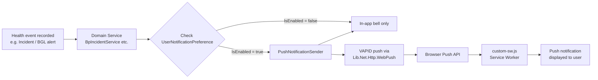
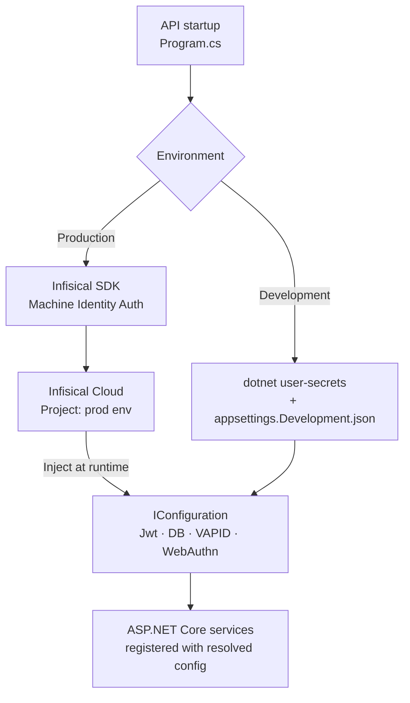

# Vitara — System Architecture

## Overview

Vitara is a Progressive Web Application (PWA) for chronic disease management, built with an Angular 21 frontend and a .NET 10 REST API backend, backed by PostgreSQL and hosted on Ubuntu 22.04.

---

## System Architecture Diagram



---

## Component Breakdown

### Frontend — Angular 21 PWA

| Layer | Detail |
|---|---|
| **Framework** | Angular 21.2.5, TypeScript ~5.9.3 |
| **UI Library** | Angular Material + CDK 21.2.3 |
| **Charts** | Chart.js 4.5.1 |
| **Excel** | xlsx 0.18.5 (client-side report generation) |
| **PWA** | Custom service worker (`custom-sw.js`), `ngsw-config.json`, `manifest.webmanifest` |
| **Offline** | Offline queue service — defers mutations when offline |
| **Auth** | JWT interceptor (`AuthInterceptor`), TOTP MFA, WebAuthn biometric |
| **Hosting** | Nginx serving static build at `vitara.elroitec.com` |

**Feature Modules**

| Module | Functionality |
|---|---|
| `assessment` | Blood glucose level (BGL) assessment |
| `blood-pressure` | BP session recording, history, charts |
| `dashboard` | Summary cards, recent health data |
| `incident` | Diabetes & BP incident logging |
| `management` | Admin user management |
| `meal-entry` | Meal / carbohydrate logging |
| `offline-queue` | View and manage queued offline actions |
| `profile` | User profile, MFA, biometric, notifications, Google Drive, care recipients |
| `supplies` | Supplies tracking and projection |
| `temperature` | Body temperature recording |
| `weight` | Weight tracking |
| `report-feature-bug` | In-app bug and feature reporting |
| `release-notes` | App changelog |
| `push-test` | Push notification testing (dev/admin) |
| `about` | App information |

---

### Backend — .NET 10 API

| Layer | Detail |
|---|---|
| **Framework** | ASP.NET Core 10.0 / Kestrel on port 5000 |
| **ORM** | EF Core 10 + Npgsql 10.0.0 (snake_case naming) |
| **Auth** | JWT Bearer (`Microsoft.AspNetCore.Authentication.JwtBearer`), two keys: standard + MFA temp |
| **MFA** | TOTP via `MfaService` + `QRCoder` v1.7.0 |
| **Biometric** | FIDO2/WebAuthn via `Fido2NetLib` v3.0.1 |
| **Documentation** | Swagger / OpenAPI via `Swashbuckle.AspNetCore` v10.1.4 |
| **Hosting** | Nginx reverse proxy → Kestrel at `vitarapi.elroitec.com` |

**Controller Groups**

| Domain | Controllers |
|---|---|
| Auth / Users | `AuthController`, `WebAuthnController`, `RoleController`, `UserConditionsController`, `UserDeviceController` |
| Clinical | `AssessmentController`, `BloodPressureController`, `TemperatureController`, `WeightController`, `MealEntryController` |
| Incidents | `IncidentController`, `BpIncidentController` |
| Medications | `DiabetesMedicationController`, `BpMedicationController` |
| Classifications | `BglClassificationController`, `BpClassificationRangeController`, `PulseRateClassificationRangeController`, `TemperatureClassificationRangeController` |
| Care | `CareRecipientController`, `CycleController`, `ConditionController`, `DelinkRequestController` |
| Supplies | `SupplyController`, `SupplyItemController`, `SupplyReportController` |
| Admin | `AppConfigController`, `FeatureBugReportController` |
| Notifications | `NotificationController`, `NotificationPreferenceController`, `PushController` |
| Integrations | `GoogleDriveAuthController`, `ExportController` |

---

### Database — PostgreSQL 15+

| Detail | Value |
|---|---|
| **Engine** | PostgreSQL 15+ |
| **ORM** | EF Core 10 with `UseSnakeCaseNamingConvention()` |
| **Connection** | `localhost` only; remote access via SSH tunnel |
| **Retry policy** | `EnableRetryOnFailure(maxRetry: 5, delay: 30s)` |
| **Key tables** | `users`, BGL entries, blood pressure sessions, temperature, weight, meals, incidents, supplies, care_recipients, conditions, cycles, notifications, user_devices, webauthn_credentials, user_google_drive_tokens, app_config, notification_type, user_notification_preferences |

---

### External Services

#### Infisical — Secrets Management

| Detail | Value |
|---|---|
| **SDK** | `Infisical.Sdk` v3.0.4 |
| **Auth method** | Machine Identity / Universal Auth |
| **Environment slug** | `prod` |
| **Secrets managed** | PostgreSQL connection string, `Jwt:Key`, `Jwt:MfaTempKey`, `Vapid:Subject/PublicKey/PrivateKey`, `WebAuthn:RelyingPartyId/Origin` |
| **Dev alternative** | `dotnet user-secrets` (never committed) |

#### Google Drive API v3

| Detail | Value |
|---|---|
| **SDK** | `Google.Apis.Drive.v3` v1.73.0.4045 |
| **Auth flow** | OAuth 2.0 — offline access (refresh token) |
| **OAuth callback** | `vitarapi.elroitec.com/api/google-drive/callback` |
| **Token storage** | `UserGoogleDriveTokens` table in PostgreSQL |
| **Use case** | Upload ClosedXML-generated Excel clinical reports |

#### Web Push (VAPID)

| Detail | Value |
|---|---|
| **Library** | `Lib.Net.Http.WebPush` v3.3.1 |
| **Keys** | VAPID public/private keys managed by Infisical |
| **Subscriptions** | Stored per user-device in PostgreSQL |
| **Trigger** | `PushNotificationSender` dispatches on health alerts and incidents |
| **Browser** | Delivered via browser push API to PWA service worker |

#### Cloudflare

| Detail | Value |
|---|---|
| **CDN / WAF** | Cloudflare proxies all traffic to the VPS — DDoS protection, caching |
| **DNS** | Domain registered at Namesilo; Cloudflare nameservers manage `elroitec.com` |
| **Pages** | Hosts MkDocs documentation site at `vitara-docs.pages.dev` |
| **Zero Trust** | Optional Google Workspace / GitHub IdP SSO gate on the docs site |

---

### Authentication Flows



---

### Notification Flow



---

### Secrets Management Flow



---

### Deployment Stack

```
                          Namesilo DNS (elroitec.com)
                                    │
                          Cloudflare Nameservers
                          CDN · WAF · DDoS protection
                                    │
                            Ubuntu 22.04 VPS
                            ┌───────────────┐
                            │     Nginx     │  ← TLS termination (Let's Encrypt)
                            └───┬───────┬───┘
                                │       │
                    ┌───────────┘       └──────────────┐
                    │                                  │
          vitara.elroitec.com             vitarapi.elroitec.com
          Angular 21 static build         Kestrel :5000 (.NET 10)
          /var/www/vitara                 systemd service
                                               │
                                         PostgreSQL 15
                                         (localhost:5432)
                                               │
                                      EF Core 10 migrations
```

---

*Last updated: March 2026*
